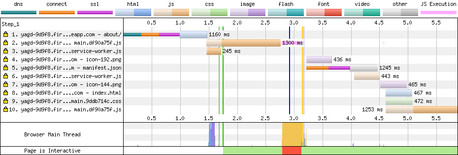
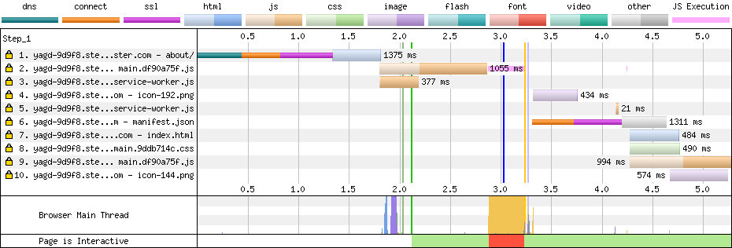
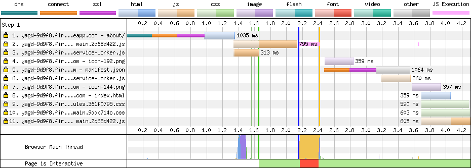
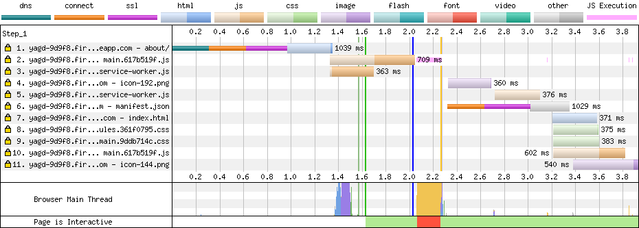
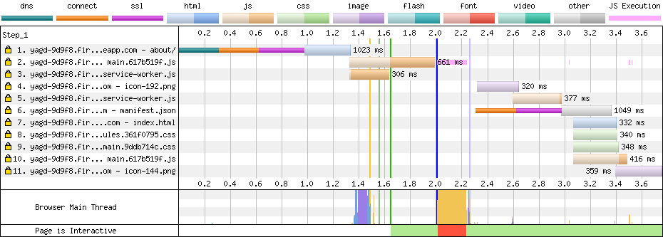

Experiment: how much faster you can make [An Almost Static Stack](https://github.com/superhighfives/an-almost-static-stack).

Let's set expectations upfront. I do not suggest to switch to one technology over another. I use real-life measurement metrics and minimal example. The purpose is to show that you can get a lot of performance improvement, with a small investment of your time, it is not hard at all. You do not need Ph.D. to do this.

Setup:
- All measurements were done using [webpagetest](https://www.webpagetest.org) with following settings: "From: Dulles, VA - Moto G4 - Chrome - 3G".
- Most measurements were done against firebase (except round 0 and round 4.1), but still, there is variation in Time To the First Byte from 1.3s to 1.7s. This is because of network fluctuations, it is out of experiment scope. Apply correlation accordingly.
- Code for experiments are stored in [stereobooster/an-almost-static-stack#experiment](https://github.com/stereobooster/an-almost-static-stack/tree/experiment)
- Each step is stored in the separate tag. To test it, do the following:

```sh
git clone https://github.com/stereobooster/an-almost-static-stack.git
cd an-almost-static-stack
git checkout round-N
yarn install
yarn build or yarn deploy
```

## Round 0

Let's measure what we have out of the box. Original setup uses Surge ([demo](https://yadg.surge.sh)).

```
git checkout round-0
```


It performs not that well:

- First Byte Time: D, 1.966s
- Keep-alive: F, Disabled
- HTTP1
- Compression: gzip (not brotli)

## First round: hosting

First improvement woud be to choose better hosting or use CDN in front of it. So you can use anything from the following range (I'm listing popular and free or cheap options):

|                       | Expiration headers | Easy to deploy | Free plan | Custom Headers   | HTTP push        |
|-----------------------|--------------------|----------------|-----------|------------------|------------------|
| Surge + Cloudflare    | ± [1][1]           | +              | +         | - [5][5]         | -                |
| Now + Cloudflare      | ± [2][2], [6][6]   | ± [3][3]       | +         | ± [2][2], [6][6] | ± [2][2], [6][6] |
| S3 + Cloudflare       | +                  | ± 4            | +         | - [7][7]         | -                |
| S3 + Cloudfront       | +                  | -              | -         | ± [8][8]         | -                |
| Firebase              | +                  | +              | +         | +                | -                |
| Firebase + Cloudflare | +                  | +              | +         | +                | +                |

[1]: https://surge.sh/help/using-lucid-caching-automatically
[2]: https://zeit.co/api
[3]: https://github.com/zeit/now-cli/issues/992
[5]: https://github.com/sintaxi/surge/issues/165
[6]: https://github.com/zeit/serve/issues/289
[7]: https://github.com/aws/aws-cli/issues/818#issuecomment-69972662
[8]: https://medium.com/@tom.cook/edge-lambda-cloudfront-custom-headers-3d134a2c18a2

4: There is AWS CLI, but to set headers you need to use a script

**Solution**: I will use Firebase because this is the easiest option for me, but you can choose any option. Just make sure it has HTTP2 support and ability to set expiration headers.

🔖 [round-1](https://github.com/stereobooster/an-almost-static-stack/compare/round-0...stereobooster:round-1?expand=1)


## Second round: PWA

Let's test with Lighthouse. Use Lighthouse checkbox in webpagetest interface.

**Performance**: 79

**Lighthouse PWA Score**: 45

- Does not register a service worker
- Does not respond with a 200 when offline
- Does not redirect HTTP traffic to HTTPS
- User will not be prompted to Install the Web App. Failures: No manifest was fetched, Site does not register a service worker, Service worker does not successfully serve the manifest's start_url.
- Is not configured for a custom splash screen. Failures: No manifest was fetched.
- Address bar does not match brand colors. Failures: No manifest was fetched, No `<meta name="theme-color">` tag found.

This is because the project was created with an old version of c-r-a. A new version comes with service worker out of the box.

**Solution**: Let's add it back by copying from the fresh project. I also added icons and appcache-nanny. Important: use `Cache-Control:max-age=0` for `service-worker.js`.


🔖 [round-2](https://github.com/stereobooster/an-almost-static-stack/compare/round-1...stereobooster:round-2?expand=1)

**Lighthouse PWA Score**: 91

- Does not redirect HTTP traffic to HTTPS

## Third round: render-blocking stylesheets

Next problem: Lighthouse complains about render-blocking stylesheets.

| Load Time | First Byte | Start Render | Speed Index | First Interactive (beta) | Time   | Requests | Bytes In | Time   | Requests | Bytes In | Cost  |
|-----------|------------|--------------|-------------|--------------------------|--------|----------|----------|--------|----------|----------|-------|
| 3.566s    | 1.731s     | 2.558s       | 2558        | 3.814s                   | 3.566s | 3        | 90 KB    | 5.593s | 10       | 211 KB   | $---- |

**Solution**: switch from `react-snapshot` to `react-snap` and use `inlineCss` feature.

`inlineCss` - will either inline critical CSS and load all the rest in a non-blocking manner or will inline all CSS directly in HTML.

**Caution**: inlineCss is an experimental feature. Test carefully if you are using it.

🔖 [round-3](https://github.com/stereobooster/an-almost-static-stack/compare/round-2...stereobooster:round-3?expand=1)

**Start Render** reduced by 0.5s


| Load Time | First Byte | Start Render | Speed Index | First Interactive (beta) | Time   | Requests | Bytes In | Time   | Requests | Bytes In | Cost  |
|-----------|------------|--------------|-------------|--------------------------|--------|----------|----------|--------|----------|----------|-------|
| 3.766s    | 1.723s     | 2.032s       | 2032        | 3.979s                   | 3.766s | 2        | 89 KB    | 5.704s | 9        | 210 KB   | $---- |

## Round 4: Link headers

Next optimization is pretty trivial and does not require code modification, but it requires the support of custom headers from your hosting. You will need to be able to set `Link` header.

`react-snap` can generate Link headers in [superstatic](https://github.com/firebase/superstatic) format, like this:

```json
{
  "source":"about",
  "headers":[{
    "key":"Link",
    "value":"</static/js/main.df90a75f.js>;rel=preload;as=script,</service-worker.js>;rel=preload;as=script"
  }]
}
```

**Solution**: I wrote a small script, to make use of this data and pass it to firebase.

🔖 [round-4](https://github.com/stereobooster/an-almost-static-stack/compare/round-3...stereobooster:round-4?expand=1)

**First Interactive (beta)** reduced by 0.6s

~~**Caution**: there is a bug in firebase-cli which prevents setting header for root path. So I tested `/about` page.~~. Fixed in `v1.4.1`.

~~**Caution 2**: Link headers contain `service-worker.js`, which won't be used by all browsers. I will need to fix this issue. On the other side, all main browsers have this feature in technical preview, so it will be resolved soon.~~ Fixed in `v1.6.0`.



| Load Time | First Byte | Start Render | Speed Index | First Interactive (beta) | Time   | Requests | Bytes In | Time   | Requests | Bytes In | Cost  |
|-----------|------------|--------------|-------------|--------------------------|--------|----------|----------|--------|----------|----------|-------|
| 2.908s    | 1.559s     | 1.883s       | 1883        | 3.113s                   | 2.908s | 3        | 109 KB   | 4.647s | 10       | 217 KB   | $---- |

## Round 4: HTTP2 server push

This strategy the same as above, but I will proxy all requests through Cloudflare and will use [Cloudflare feature, that will convert `Link` headers, to HTTP2 server push](https://blog.cloudflare.com/announcing-support-for-http-2-server-push-2/).



| Load Time | First Byte | Start Render | Speed Index | First Interactive (beta) | Time   | Requests | Bytes In | Time   | Requests | Bytes In | Cost  |
|-----------|------------|--------------|-------------|--------------------------|--------|----------|----------|--------|----------|----------|-------|
| 3.005s    | 1.734s     | 2.121s       | 2121        | 3.226s                   | 3.005s | 3        | 88 KB    | 5.498s | 10       | 187 KB   | $---- |

**Conclusion**: not worth it, almost no changes.

## Round 5: minify JS, by removing runtime of CSS-in-JS

Not saying you should do it, but I want to show you what price you are paying by using CSS-in-JS solution. I know that styled-components have nice development experience.

**Solution**: replace `styled-components` with `CSS modules`. To do this I will use `c-r-a` fork with CSS modules support.

🔖 [round-5](https://github.com/stereobooster/an-almost-static-stack/compare/round-4...stereobooster:round-5?expand=1)

```
File sizes after gzip:

  67 KB (-19.62 KB)  build/static/js/main.2d68d422.js
  511 B              build/static/css/main-cssmodules.361f0795.css
  191 B              build/static/css/main.9ddb714c.css
```

**First Interactive (beta)** reduced by 0.2s



| Load Time | First Byte | Start Render | Speed Index | First Interactive (beta) | Time   | Requests | Bytes In | Time   | Requests | Bytes In | Cost  |
|-----------|------------|--------------|-------------|--------------------------|--------|----------|----------|--------|----------|----------|-------|
| 2.407s    | 1.301s     | 1.661s       | 1661        | 2.654s                   | 2.407s | 5        | 90 KB    | 4.054s | 13       | 179 KB   | $---- |

## Round 6: minify JS, by replacing react with preact

Another risky move, but I want to show you what price you are paying by using React. I know that React is safer.

**Solution**: use script which will replace `react` with `preact`, using `preact-compat`.

🔖 [round-6](https://github.com/stereobooster/an-almost-static-stack/compare/round-5...stereobooster:round-6?expand=1)

```
File sizes after gzip:

  32.17 KB (-34.83 KB)  build/static/js/main.617b519f.js
  511 B                 build/static/css/main-cssmodules.361f0795.css
  191 B                 build/static/css/main.9ddb714c.css
```



| Load Time | First Byte | Start Render | Speed Index | First Interactive (beta) | Time   | Requests | Bytes In | Time   | Requests | Bytes In | Cost  |
|-----------|------------|--------------|-------------|--------------------------|--------|----------|----------|--------|----------|----------|-------|
| 2.027s    | 1.333s     | 1.628s       | 1628        | 2.265s                   | 2.027s | 3        | 54 KB    | 3.684s | 11       | 108 KB   | $---- |

**First Interactive (beta)** reduced by 0.4s

**Conclusion**: Preact is incompatible with some React 16 features.

## Round 7: load JS in a non-blocking manner

**Solution**: use `asyncScriptTags` feature of `react-snap`

🔖 [round-7](https://github.com/stereobooster/an-almost-static-stack/compare/round-6...stereobooster:round-7?expand=1)



| Load Time | First Byte | Start Render | Speed Index | First Interactive (beta) | Time   | Requests | Bytes In | Time   | Requests | Bytes In | Cost  |
|-----------|------------|--------------|-------------|--------------------------|--------|----------|----------|--------|----------|----------|-------|
| 2.012s    | 1.325s     | 1.685s       | 1685        | 2.239s                   | 2.012s | 3        | 54 KB    | 3.554s | 11       | 108 KB   | $---- |

**Caution**: this will work if you have a mostly static website or website with progressive enhancement in mind.

**Conclusion**: not worth it, almost no changes.

## Round 8: server-side only React

[Inspired by Netflix](https://twitter.com/NetflixUIE/status/923374215041912833).

**Solution**: use `removeScriptTags` feature of `react-snap`

🔖 [round-8](https://github.com/stereobooster/an-almost-static-stack/compare/round-7...stereobooster:round-8?expand=1)

**Lighthouse PWA Score**: 45


| Load Time | First Byte | Start Render | Speed Index | First Interactive (beta) | Time   | Requests | Bytes In | Time   | Requests | Bytes In | Cost  |
|-----------|------------|--------------|-------------|--------------------------|--------|----------|----------|--------|----------|----------|-------|
| 1.161s    | 1.326s     | 1.665s       | 1665        | 1.474s                   | 1.161s | 1        | 2 KB     | 2.699s | 3        | 14 KB    | $---- |


## Round 9: vanilla create-react-app

This is for comparison - original create-react-app without any additional optimizations.

🔖 [round-9](https://github.com/stereobooster/an-almost-static-stack/compare/round-8...stereobooster:round-9?expand=1)

**Lighthouse PWA Score**: 82


| Load Time | First Byte | Start Render | Speed Index | First Interactive (beta) | Time   | Requests | Bytes In | Time   | Requests | Bytes In | Cost  |
|-----------|------------|--------------|-------------|--------------------------|--------|----------|----------|--------|----------|----------|-------|
| 2.613s    | 1.330s     | 3.178s       | 3178        | 2.951s                   | 2.613s | 4        | 68 KB    | 4.216s | 9        | 84 KB    | $---- |


## Not covered subjects

I haven't explored how to optimize fetch requests (AJAX), `async components`, images, fonts, Redux or Apollo. Maybe will cover in future.

